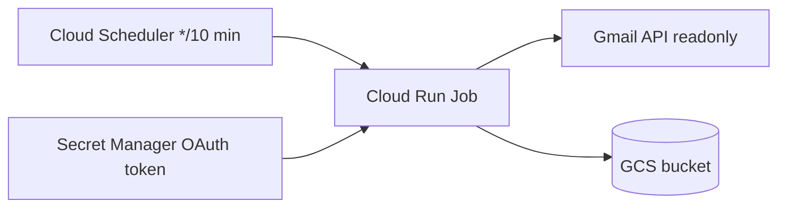

# Cloud Run recruiter scan

Automated Gmail recruiter scanning on **weekdays** via Cloud Run Job + Cloud Scheduler. New messages are deduplicated and stored in GCS at `gs://$GCS_BUCKET/inbox/recruiter/`.

Default schedule: **`*/10 * * * 1-5`** in **`America/Los_Angeles`** (every 10 minutes, Monday–Friday). Override in `cloud/config.env`:

```bash
SCHEDULE_CRON=*/10 8-18 * * 1-5   # optional: business hours only
SCHEDULE_TIMEZONE=America/Los_Angeles
```

## Architecture



Local workflow after cloud scans:

```bash
cd tools/gmail
source .venv/bin/activate
export GCS_BUCKET=your-bucket   # same as config.env
python sync_gcs_inbox.py        # → inbox/recruiter/
```

Application PDFs and draft replies stay local (`render_application.sh`, `draft_recruiter_reply.py`).

## Full automation (not built yet)

Cloud Run covers **inbox intake only**. A closed loop would add:

| Stage | Today | To automate |
|-------|--------|-------------|
| Scan Gmail | Cloud Run + Scheduler (weekdays) | Done |
| Sync to Mac | Manual `sync_gcs_inbox.py` | Local cron after sync |
| Score + tailor | Cursor + `.prompt` | Cursor Automation or LLM API job |
| Render PDF/DOCX | `render_application.sh` (Chrome on Mac) | Keep local, or add headless Chrome to container |
| Reply | `draft_recruiter_reply.py` | Auto-draft; **never auto-send** without approval |
| Track state | `meta.json` + inbox JSON | Shared `processed` index keyed by `message_id` |

Recommended phases:

1. **Intake** (current) — scan weekdays, store in GCS.
2. **Triage queue** — mark each inbox JSON as `pending` / `skipped` / `applied`; skip Indeed/LinkedIn noreply unless `--force`.
3. **Generate** — scheduled Cursor agent (or cloud LLM) reads queue + `.prompt`, writes `applications/{slug}/`.
4. **Draft** — local script renders PDFs and creates Gmail drafts for matches ≥ 80%.
5. **Approve** — you review drafts in Gmail; optional `--send` only after explicit approval.

See discussion in repo chat for trade-offs (Cursor vs cloud LLM, PDF rendering, approval gates).

## One-time setup

### 1. Local Gmail OAuth (if not done)

```bash
cd tools/gmail
python3 -m venv .venv && source .venv/bin/activate
pip install -r requirements.txt
python scan_recruiter_mail.py
```

### 2. GCP config

```bash
cp cloud/config.env.example cloud/config.env
# Edit: GCP_PROJECT, GCP_REGION, GCS_BUCKET
```

Use the **same GCP project** where Gmail API and OAuth client are configured.

### 3. Upload OAuth secrets

```bash
chmod +x cloud/setup_secrets.sh cloud/deploy.sh
./cloud/setup_secrets.sh
```

Uploads `credentials.json` and `token.json` to Secret Manager. Re-run whenever you re-authorize locally.

### 4. Deploy job + scheduler

```bash
./cloud/deploy.sh
```

This enables APIs, creates the GCS bucket, builds the container, deploys the Cloud Run Job, and creates a weekday scheduler cron (default `*/10 * * * 1-5`, America/Los_Angeles).

### 5. Test

```bash
source cloud/config.env
gcloud run jobs execute "$JOB_NAME" --region="$GCP_REGION" --wait
gcloud storage cat "gs://${GCS_BUCKET}/inbox/recruiter/_state/latest_run.json"
```

## Costs

Typical usage is well within free tiers: ~4,320 job runs/month at 512Mi × short runtime, plus minimal GCS and Scheduler cost.

## Troubleshooting

| Issue | Fix |
|-------|-----|
| Token expired in cloud | Re-auth locally, run `setup_secrets.sh` again |
| Job permission denied on secrets | Re-run `setup_secrets.sh` (grants job SA accessor) |
| Scheduler not firing | `gcloud scheduler jobs describe $SCHEDULER_NAME --location=$GCP_REGION` |
| Empty scans | Check `GMAIL_QUERY` in config.env; verify test user on OAuth consent screen |

## Files

| File | Purpose |
|------|---------|
| `job_runner.py` | Cloud Run entrypoint |
| `storage.py` | GCS read/write + dedupe |
| `sync_gcs_inbox.py` | Pull bucket → local `inbox/recruiter/` |
| `Dockerfile` | Job container |
| `cloud/deploy.sh` | Build + deploy + scheduler |
| `cloud/setup_secrets.sh` | OAuth → Secret Manager |
